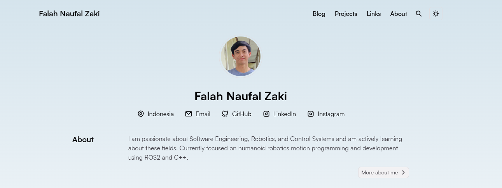

# lexciese.github.io
# Personal Portfolio & Technical Blog

Personal website showcasing my professional journey, technical story, experience through blog posts.

[](https://github.com/cworld1/astro-theme-pure/blob/main/LICENSE)



## Local development

Environment requirements:

- [Nodejs](https://nodejs.org/): 18.0.0+

Clone the repository:

```shell
git clone https://github.com/lexceise/lexciese.github.io.git
cd lexciese.github.io
```

Useful commands:

```shell
# install dependencies
bun install

# start the dev server
bun dev

# build the project
bun run build

# preview (after the build)
bun preview

# create a new post
bun new --draft --mdx post-title
```

## License

This project is licensed under the Apache 2.0 License.
