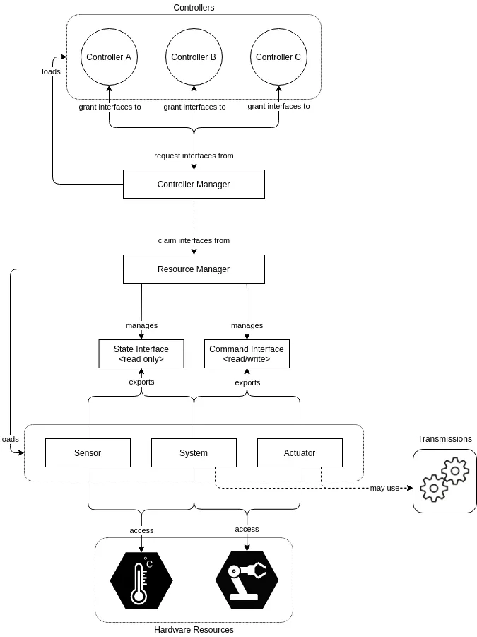
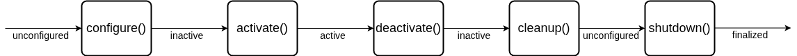

# ros2_control for everyone



**ros2_control** is a framework system developed in ROS 2 ecosystem for elevating production speed and abstraction to any hardware system. The key concept is **abstraction**. From a single framework, you can empowering any robot project to life.

## 1. The design of ros2_control

1. **Controller Manager (CM)**
Controller Manager, or in short CM, is the main component in ros2_control and a layer for connecting hardwares to the controllers. It manages the lifecyle of controllers, start and stop of controllers, and initialize the hardware. CM have access to both controllers and Resource Manager. We are configuring CM with yaml file config and manage or interfacing it via ROS service.

2. **Resource Manager (RM)**
Resource Manager, RM in short, is an abstraction for hardware and the driver. We call driver or program that drive the real hardware as hardware component in ros2_control. We are not coding this RM as it is part of ros2_control system. RM loads hardware component and manages its lifecyle: `on_init()`, `on_configure()`, `on_activate()`, `read()`, `write()`. Node lifecyle is a new concept in ROS2, not available in ROS1, in short it is a node with steroids. Don’t worry to much on lifecyle, we will see it section 3.

3. **Controller Componenents (controller_interface)**
Controllers is the program that we make to manipulate the hardware_interface. We can make many controllers for different control purpose like, for example, walking, jumping, or kick will use different controller. We seperate each control for easier management.
We can refer controllers as the same in control theory. Given input values from sensor, it will output the calculated result in the actuator. This controller_interface also use ROS2 lifecyle and a loop function method: `update()`, that access latest hardware state, write to hardware component, and execute at configured frequency in CM yaml file.

4. **Hardware Components (hardware_interface)**
The hardware component is the driver program that we make to drive, communicate with real, pyhsical hardware, on our robot. hardware_interface represent abstraction in ros2_control. It purpose is to access the real hardware, abstract it, so that we can access the hardware state and hardware command from controller_interface. hardware_interface export hardware state to controller and receive hardware command from controller. There are three types of hardware component:

   - `Sensor`: can only read hardware state, e.g.: temperature sensor (read temperature)
   - `Actuator`: can only write command to hardware, e.g.: motor (write pwm signal)
   - `System`: capable of both sensors and actuator, e.g.: servo(read and write position)

---

## 2. ROS2 Lifecycle

Node lifecyle, introduced in ROS2, is designed as a system for managing the states of ROS2 node in ordered and predictable way. It is usefull in robotics application where we need full control for the node initialization, startup, shutdown, and the program loop. Used in a system where we need to make sure we need to run the initialization process first and shutdown the program properly so that the robot have the expected behavior.

The lifecycle includes these states:
- **Unconfigured**: Initial state
- **Inactive**: Configured but not operational
- **Active**: Fully operational
- **Finalized**: Shutting down

Transitions between states are triggered by these functions:
- `configure()`: Initialize parameters, set up publishers/subscribers
- `activate()`: Start program execution (e.g., timers)
- `deactivate()`: Stop execution while retaining configuration
- `cleanup()`: Release resources and clear data
- `shutdown()`: Gracefully terminate the program



---

## 3. Adaptation of ROS2 Lifecyle in hardware_interface and controller_interface

ros2_control use the same principle as the lifecycle. Both controller_interface and hardware_interface adapted the design of node lifecyle with more fine control of the program.

- `on_init()` \
Called once when the controller is first instantiated.
Used for basic initialization tasks like member variable setup.
**Should not access ROS interfaces** (publishers, subscribers, parameters).
Failures here prevent the controller from being used.

- `on_configure()` \
Transitions the controller from "Unconfigured" to "Inactive" state.
**Used to load parameters, initialize ROS interfaces, and allocate resources.**
Sets up communication channels without actively using them.
Common tasks: creating publishers/subscribers, loading configuration

- `on_activate()` \
Transitions the controller from "Inactive" to "Active" state.
Enables the controller to **start operating and controlling hardware**.
Typically starts publishing control commands and processing sensor data

- `on_deactivate()`\
Transitions the controller from "Active" to "Inactive" state.
S**tops active control while maintaining configuration.**
Ensures the controller stops sending commands to hardware.
Allows for quick reactivation later without reconfiguring.

- `on_error()`\
**Called when the controller encounters an error during operation**.
Provides opportunity for error handling and graceful degradation.
May attempt recovery or prepare for cleanup/shutdown.

- `on_cleanup()`\
Transitions from "Inactive" to "Unconfigured" state.
**Releases resources acquired during configuration.**
Undoes what was done in on_configure().
Returns the controller to a state where it can be reconfigured.

- `on_shutdown()`\
Called when the controller is being terminated.
Performs final cleanup before destruction.
Releases any remaining resources.

### 3.1 Main Loop

Both **controller_interface** and **hardware_interface** have main loop that run at the specified frequency. This main loop can only be executed if the state is active, which is after `on_activate()` successfully executed without error.

- `read()`, `write()` \
The main loop for **hardware_interface** with type **sensor** only capable of `read()`, **actuator** can only `write()`, and **system** capable of both.

- `update()` \
The main loop for **controller_interface**.

### 3.2 Hardware Abstraction Management by **Export and Claim**

Every hardware state or command that we accessed from `hardware_interface` needs to be exported or advertised so that the controller_interface can access it. Based on the type of hardware_interface (Sensor, Actuator, or System), we use `export_state_interface` and `export_command_interface`. For *sensor type* hardware, we can only `export_state_interface`. For *actuator type* hardware, we can only `export_command_interface`. *System type* hardware capable of both. 

The Resource Manager handles these exported interfaces and manages which controller can access which hardware resource. Controllers must explicitly claim the interfaces they need with `claim_interfaces()` during activation. This claiming mechanism prevents conflicts where multiple controllers might try to command the same hardware simultaneously.

The flow works as follows:
1. Hardware components export their interfaces during initialization
2. Controllers declare which interfaces they want to claim
3. Resource Manager validates and manages these claims
4. When activated, controllers gain exclusive access to their claimed command interfaces
5. Multiple controllers can read state interfaces, but only one controller can write to a command interface

This export-and-claim pattern is central to how ros2_control safely manages hardware resources across different controllers.

#### 3.2.1. **Implementation of state export in `hardware_interface`**

```c++
std::vector<hardware_interface::StateInterface> FooHardware::export_state_interfaces()
{
  std::vector<hardware_interface::StateInterface> state_interfaces;
  for (unsigned int i = 0; i < info_.joints.size(); i++) {
    state_interfaces.emplace_back(hardware_interface::StateInterface(
        info_.joints[i].name, 
        hardware_interface::HW_IF_POSITION, 
        &joints_[i].state.position));
    state_interfaces.emplace_back(hardware_interface::StateInterface(
        info_.joints[i].name, 
        hardware_interface::HW_IF_VELOCITY, 
        &joints_[i].state.velocity));
  }

  return state_interfaces;
}
```

From the code above, we are exporting the state interface by `export_state_interface()`. The example is from servo which is capable of position and velocity state. Here we have setup servo/ joint name in `info_.joints_` array. Then we push every state interface to `state_interfaces` vector. `hardware_interface::StateInterface(...)` takes prefix name (hardware name), state type (position and velocity), and variable pointer to handle the value we get from `read()` process.  

#### 3.2.2. **Implementation of hardware command export in `hardware_interface`**

```cpp
std::vector<hardware_interface::StateInterface> FooHardware::export_state_interfaces()
{
    std::vector<hardware_interface::CommandInterface> command_interfaces;
    for (uint i = 0; i < info_.joints.size(); i++) {
        command_interfaces.emplace_back(
        hardware_interface::CommandInterface(
            info_.joints[i].name, 
            hardware_interface::HW_IF_POSITION, 
            &joints_[i].command.position));
    }

return command_interfaces;
}
```

Similiar to the previous state export, we export the command interface so that the hardware can be commanded from `controller_interface`. The command interfaces takes prefix name (hardware name), command type (position), and variable pointer to handle the value we pass trough to `write()` process.  

#### 3.2.3. **Implementation of hardware claim-ing in `controller_interface`**

```cpp
controller_interface::InterfaceConfiguration 
FooController::command_interface_configuration() const
{
  controller_interface::InterfaceConfiguration config;
  config.type = controller_interface::interface_configuration_type::INDIVIDUAL;
  for (const auto& joint_name : joint_names_)
  {
      config.names.push_back(joint_name + "/" + 
                          hardware_interface::HW_IF_POSITION);
  }
  return config;
}

controller_interface::InterfaceConfiguration 
FooController::state_interface_configuration() const
{
  controller_interface::InterfaceConfiguration config;
  config.type = controller_interface::interface_configuration_type::ALL;
  return config;
}
```

Take a look at `command_interface_configuration()` first. We set the InterfaceConfiguration to INDIVIDUAL. It means we only claim the hardware individually, choosing the hardware what we want to command. The format to claim the hardware is a string of "hardware_name/command_type", e.g.: "head_pan/position" then we push it to the array.

Claiming the hardware state in `state_interface_configuration()` is the same as in command_interface_configuration(). In the example, we set the type to claim to ALL, we claim all available state exported from `hardware_interface`.

> [!IMPORTANT]  
> **Hardware command** can **only** be claimed **once** in any controller_interface. Claiming the hardware command in multiple controller_interface can result in hardware conflict and raise error from the Resource Manager.
